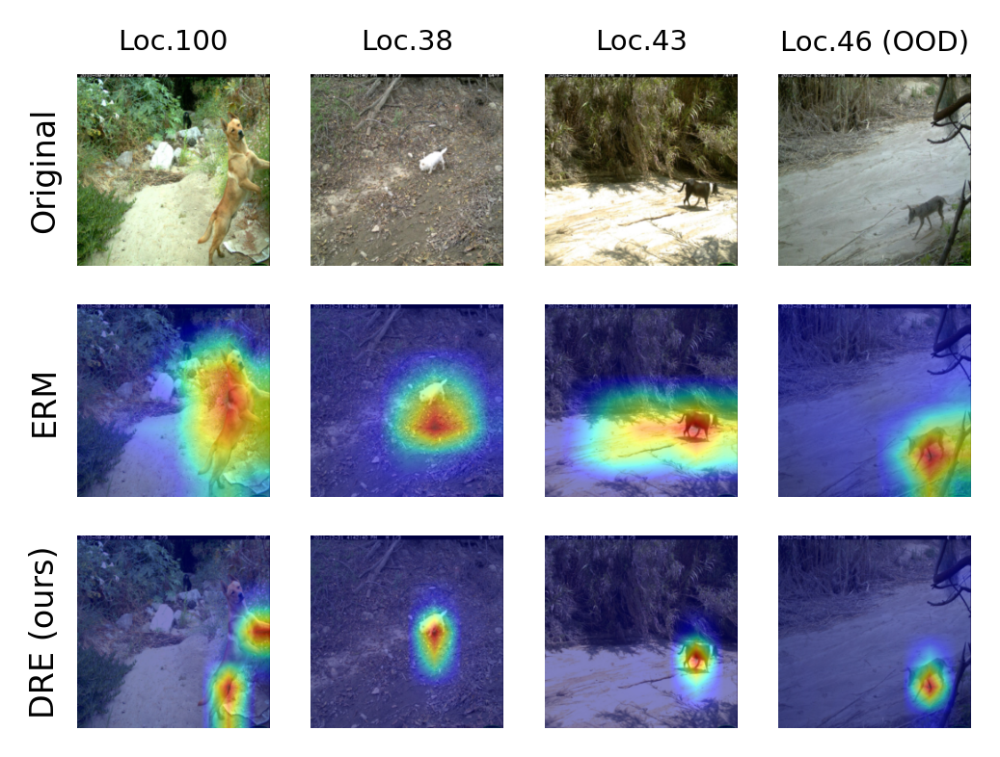

# Are Data-driven Explanations Robust against Out-of-distribution Data?

This repository holds the Pytorch implementation of **Distributionally Robust Explanations (DRE)** in [Are Data-driven Explanations Robust against Out-of-distribution Data?](https://arxiv.org/pdf/2303.16390.pdf) by Tang Li, Fengchun Qiao, Mengmeng Ma, and Xi Peng.
If you find our code useful in your research, please consider citing:

```
@inproceedings{li2023dre,
 title={Are Data-driven Explanations Robust against Out-of-distribution Data?},
 author={Li, Tang and Qiao, Fengchun and Ma, Mengmeng and Peng, Xi},
 booktitle={Proceedings of the IEEE Conference on Computer Vision and Pattern Recognition (CVPR)},
 year={2023}
}
```

## Introduction

We study the out-of-distribution (OOD) robustness of data-driven explanations.
Our evaluations prove that data-driven explanations are susceptible to distributional shifts.
However, acquiring the ground truth explanations for all samples or obtaining the one-to-one mapping between samples from different distributions are prohibitively expensive or even impossible in practice.
To this end, we propose Distributionally Robust Explanation (DRE) that, inspired by self-supervised learning, leveraging the mixed explanation to provide supervisory signals for the learning of explanations.

## Quick start
This repository reproduces our results on Terra Incognita, VLCS, and Urban Land, which is build upon Python3, Pytorch v1.12.1, and CUDA v10.2 on Ubuntu 18.04.
Please install all required packages by running:

```
pip install -r requirements.txt
```

## Results on Terra Incognita

Illustration of explanations from different data distributions in the Dog class of Terra Incognita dataset:



We provide the pretrained weights of the ResNet-50 model trained by ERM (baseline) and DRE (ours), and demonstration code of the explanation results.
To reproduce the results on Terra Incognita, please the following notebook:
```
terra_reproduce.ipynb
```

## TODO

- [ ] Training code (coming soon)
- [ ] Evaluation code (coming soon)
- [ ] Terra Incognita
- [ ] VLCS
- [ ] Urban Land


## Acknowledgement

Part of our code is borrowed from the following repositories.

- [DomainBed](https://github.com/facebookresearch/DomainBed)
- [Captum](https://github.com/pytorch/captum)


We thank to the authors for releasing their codes. Please also consider citing their works.