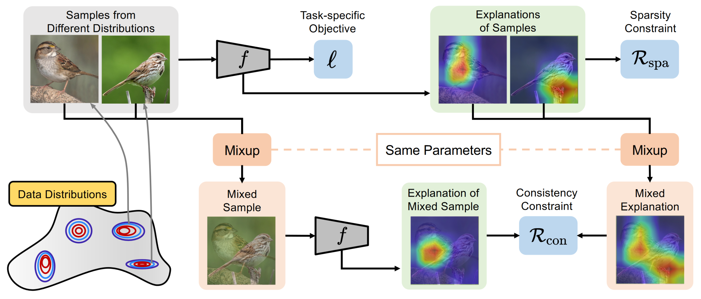
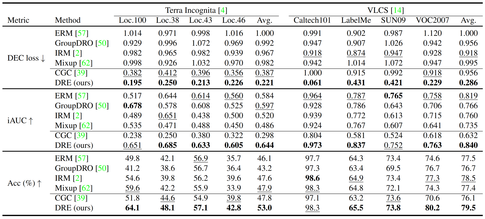

# Are Data-driven Explanations Robust against Out-of-distribution Data?
[[Paper](https://arxiv.org/pdf/2303.16390.pdf)] [[Code](https://github.com/tangli-udel/DRE)] [[Video](https://www.youtube.com/watch?v=4-8zMdB83x8)] [[Deep-REAL Lab](https://deep-real.github.io/)]

This repository holds the Pytorch implementation of **Distributionally Robust Explanations (DRE)** in [Are Data-driven Explanations Robust against Out-of-distribution Data?](https://arxiv.org/pdf/2303.16390.pdf) by Tang Li, Fengchun Qiao, Mengmeng Ma, and Xi Peng.
If you find our code useful in your research, please consider citing:

```
@inproceedings{li2023dre,
 title={Are Data-driven Explanations Robust against Out-of-distribution Data?},
 author={Li, Tang and Qiao, Fengchun and Ma, Mengmeng and Peng, Xi},
 booktitle={Proceedings of the IEEE Conference on Computer Vision and Pattern Recognition (CVPR)},
 year={2023}
}
```

## Introduction

We study the out-of-distribution (OOD) robustness of data-driven explanations.
Our evaluations prove that data-driven explanations are susceptible to distributional shifts.
However, acquiring the ground truth explanations for all samples or obtaining the one-to-one mapping between samples from different distributions are prohibitively expensive or even impossible in practice.
To this end, we propose Distributionally Robust Explanation (DRE) that, inspired by self-supervised learning, leveraging the mixed explanation to provide supervisory signals for the learning of explanations.




## Pretrained Weights
DRE models:
- Terra Incognita: [[tst_env=0](https://drive.google.com/file/d/1rm57wOaoCcNl7n1vzOswKdSPI8gkXkcB/view?usp=drive_link)] [[tst_env=1](https://drive.google.com/file/d/1vZ-QvWMEo4tUFUvxR6bmduUYotNGpeg9/view?usp=drive_link)] [[tst_env=2](https://drive.google.com/file/d/1Be_6spJHP_IXyYwlOq4BLnS_OQ7WzgdL/view?usp=drive_link)] [[tst_env=3](https://drive.google.com/file/d/1r4UYOi2P1QmW2idyhsSW_DFI816WuAbj/view?usp=drive_link)]
- VLCS: [[tst_env=0](https://drive.google.com/file/d/1xR3fHmBOzR715fmHVTBjX0Ke-pdP1pZW/view?usp=drive_link)] [[tst_env=1](https://drive.google.com/file/d/1rwr2y9ewjUtEm2bx0j0WAougdxHfc6gc/view?usp=drive_link)] [[tst_env=2](https://drive.google.com/file/d/1B0OfbQYbqJyNbuvLk9RKH_3AcMxSms2O/view?usp=drive_link)] [[tst_env=3](https://drive.google.com/file/d/1DNkuHlIJ7dF9eaOKqDFdQlV-30cmc1aq/view?usp=drive_link)]


## Quick Start
This repository reproduces our results on Terra Incognita and VLCS, which is build upon Python3, Pytorch v1.12.1, and CUDA v10.2 on Ubuntu 18.04.
Please install all required packages by running:
```
pip install -r requirements.txt
```

## Data Download
To download the datasets, please run:
```
python download.py --data_dir=./
```
Please note that some URLs may not work due to various factors. You can copy the URLs and download them manually.


## Prediction Results

The results for explanation quality and prediction accuracy:


To reproduce the results of our DRE method, please run:
```
python -m dre.train \
      --dataset terra_incognita \
      --model DRE  
```

To reproduce the results of baseline ERM method, please run:
```
python -m dre.train \
      --dataset terra_incognita \
      --model ERM  
```

For other baselines, such as IRM, GroupDRO, and Mixup, please run (you can specify the baseline method by changing the algorithm):
```
python3 -m domainbed.scripts.train \
       --data_dir=./data/ \
       --algorithm IRM \
       --dataset terra_incognita \
       --test_env 0
```


## Explanation Visualization

The explanations using Grad-CAM:


To reproduce the explanation comparison between DRE and baseline methods, please run the notebooks in "./dre/explanations/visualizations/". For example, the Grad-CAM comparison between DRE and ERM:
```
./dre/explanations/visualizations/grad_cam_erm.ipynb
```


## Explanation Fidelity
To reproduce the explanation fidelity results, please run:
```
python -m dre.explanations.fidelity.evaluate_auc \
      --ckpt-path ../../ckpts/best_model.pth \
      --root ../../../data/terra_incognita/location_38
```


## TODO
- [x] Training code
- [x] Evaluation code
- [x] Terra Incognita
- [x] VLCS
- [ ] Urban Land


## Acknowledgement
Part of our code is borrowed from the following repositories.

- [DomainBed](https://github.com/facebookresearch/DomainBed)
- [Captum](https://github.com/pytorch/captum)
- [SHAP](https://github.com/shap/shap/tree/master)
- [RISE](https://github.com/eclique/RISE) 

We thank to the authors for releasing their codes. Please also consider citing their works.